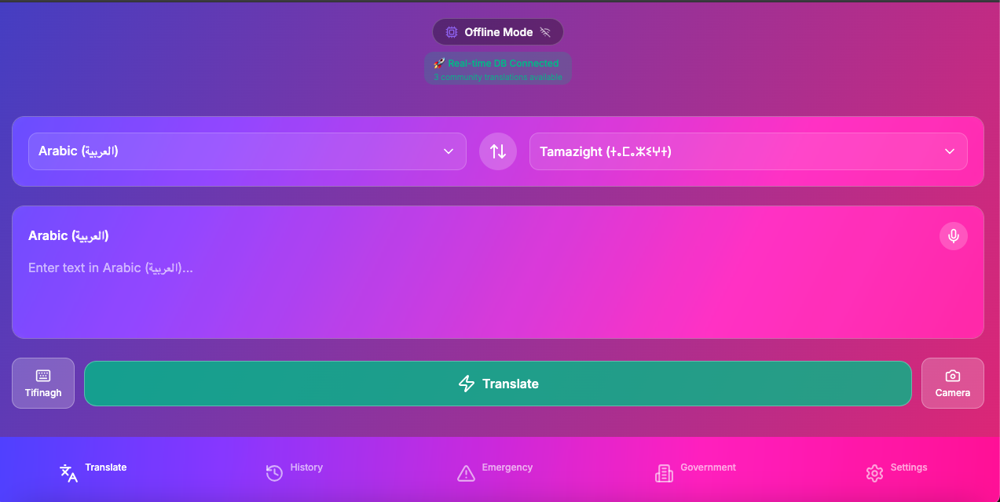

# Multi-Lingo App - Tamazight (Tamazirt) Edition 


## Bridging languages, preserving culture, empowering emergency communication.

*"In crisis, every word matters. In preservation, every language counts."*

### 🌍 Mission: Bridging Communication Gaps in Crisis

This app addresses a critical humanitarian need identified during the devastating 2023 Morocco earthquake, where rescue workers and officials struggled to communicate effectively with Moroccan Berber communities. Our solution provides instant, offline AI-powered translation to ensure no one is left behind during emergencies.

A beautiful, production-ready mobile translation app built with Expo and React Native, featuring offline on device, and online AI translation capabilities for Tamazight (ⵜⴰⵎⴰⵣⵉⵖⵜ), pronounced "Tamazirt", the indigenous Berber language of Morocco. The app provides seamless multidirectional translation between Tamazight, Arabic, French, and English with specialized features for emergency situations, government/parliamentary use and as a general purpose multi-lingual translation tool.

## About me, Gregory Kennedy the Apps Creator and Developer:   
- I am former silicon valley engineer and award winning film maker who has had the great honor and pleasure to travel the world and have worked with Nobel Peace Prize Winners (Adolfo Perez Esquivel and Mairead Corrigan McGuire), Chimpanzee expert Dr. Jane Goodall in Africa and Europe and with Zen Master Thich Nhat Hanh in France, Germany and the USA.  I have been invited to and have spoken to audiences at the United Nations in Vienna, Austria and NYC, at Stanford University and at the Googleplex in Mountain View, CA.  

- I am an American citizen whose family has lived in the USA for 400+ years, and whose ancestry is a reflection of American his and her-story consisting of two First Nation Native American tribes (Itakapa and Blackfoot), African, Irish, French and Mexican. 

LinkedIn: For more information about me, please visit my LinkedIn profile:
https://www.linkedin.com/in/gregorykennedymindfuldude/

IMDB: Award Winning Film The 5 Powers:
https://www.imdb.com/title/tt2771174/?ref_=mv_desc

## 🙏 Acknowledgments

- **My Incredible Mom Valerie who died a few months ago**: Who taught me to care about other human beings, to explore the world and to treat everyone with respect and dignity 


Gregory and his mom at Ben & Jerry's San Francisco:

- **My Moroccan Teamates**: Omar (Moroccan Berber), Hamza and Ziyad for their dedication and hard work.  Thank you and appreciate you!

- **2023 Morocco Earthquake Victims**: This app honors those affected and aims to prevent future communication barriers

- **Moroccan Berber Communities**: For preserving Tamazight language and culture through centuries

- **The Kingdom of Morocco**: For passing laws to preserve and honor Tamazight language and culture, for making Tamazight an official language of Morocco and for making Tamazight compulsory in schools.

- **Emergency Responders**: Who inspired this solution through their dedication during the crisis

- **Kaggle and Google DeepMind**: For the Gemma-3n model and Kaggle for the hackathon opportunity

- **Unsloth (Discord) Team and Dev Friends**: For their incredible support and guidance.

## 🏆 Kaggle Google Deep Mind Hackathon

### **Competition Details**
- **Event**: [Kaggle Google Deep Mind Hackathon](https://www.kaggle.com/competitions/google-gemma-3n-hackathon)
- **Timeline**: July 2025 - August 6, 2025
- **Model**: Gemma-3n 2b parameter model (released June 2025)
- **Focus**: Humanitarian AI applications using Google's latest Gemma-3n 2b parameter model (offline use) and Gemma-3 12b API (online use) for humanitarian applications of large language models

### **Technical Achievements**
- **Fine-tuning Dataset**: 100,000+ Arabic, English, French, and Tifinagh language pairs
- **Dual Architecture**: Online API + Offline on-device inference
- **Emergency Optimization**: Specialized training for crisis communication scenarios
- **Cultural Accuracy**: Moroccan Berber linguistic expertise integration



### **Innovation Highlights**
- **First Tamazight AI**: Pioneering AI translation for indigenous Berber languages
- **Emergency-First Design**: Prioritizes humanitarian use cases over general translation
- **Constitutional Compliance**: Supports Morocco's official language recognition
- **Offline Reliability**: Critical for disaster scenarios with damaged infrastructure
- **Cultural Preservation**: Promotes endangered language through modern technology

### **Impact Metrics**
- **Target Users**: Emergency responders, Berber communities, government officials
- **Use Cases**: Earthquake relief, medical emergencies, legal proceedings
- **Languages Preserved**: Tamazight variants (Tachelhit, Tarifit, Central Atlas)
- **Emergency Phrases**: 50+ critical communication phrases pre-loaded

## 🌟 Features

### 🚨 Emergency-First Design
- **Crisis Communication**: Specifically designed for earthquake and disaster relief scenarios
- **Offline-First**: Works without internet connectivity when infrastructure is damaged
- **Emergency Phrases**: Pre-loaded critical phrases for medical and rescue situations
- **Instant Access**: No setup required - works immediately for emergency responders

### 🤖 Advanced AI Translation
- **Dual-Mode Translation**:
  - **Online**: Latest Gemma-3 12b API for highest accuracy
  - **Offline**: Fine-tuned Gemma-3n 2b on-device model for privacy and reliability
- **Multidirectional Translation**: Arabic ↔ Tamazight, French ↔ Tamazight, English ↔ Tamazight
- **Context-Aware**: Emergency, government, and general contexts with specialized terminology
- **Cultural Accuracy**: Fine-tuned on 100,000+ Moroccan language pairs

### 🔤 Tamazight Language Support
- **Tifinagh Script**: Native support for ⵜⵉⴼⵉⵏⴰⵖ writing system
- **Tachelhit Focus**: Initial version optimized for Tamazight Tachelhit variant
- **Constitutional Recognition**: Aligned with Morocco's 2011 Constitution Article 5
- **Cultural Preservation**: Promotes and preserves indigenous Berber heritage

### 📱 User Experience
- **Beautiful Glass-morphism UI**: Modern, elegant interface with gradient backgrounds
- **Voice Integration**: Speech-to-text input and text-to-speech output with native audio
- **Translation History**: offline on-devive SQLite database (online convex real-time database) with favorites and search functionality
- **Responsive Design**: Perfect fit on all screen sizes with proper safe area handling
- **Haptic Feedback**: Tactile responses for better user interaction (mobile only)

## 🚀 Installation

### Prerequisites
- Node.js 18+ 
- npm or pnpm package manager
- Expo CLI (optional, for additional development features)

### Using npm

```bash
# Clone the repository
git clone <repository-url>
cd tamazight-translate

# Install dependencies
npm install

# Start the development server
npm run dev
```

### Using pnpm

```bash
# Clone the repository
git clone <repository-url>
cd tamazight-translate

# Install dependencies
pnpm install

# Start the development server
pnpm dev
```

### Development Server

After running the development command, you'll see:

```
Starting project at /home/project
› Metro waiting on exp://192.168.1.100:8081
› Scan the QR code above with Expo Go (Android) or the Camera app (iOS)
› Press a │ open Android
› Press i │ open iOS simulator
› Press w │ open web
```

- **Web**: Press `w` to open in your browser
- **Mobile**: Scan the QR code with Expo Go app
- **iOS Simulator**: Press `i` (requires Xcode)
- **Android Emulator**: Press `a` (requires Android Studio)

## 📱 App Structure & User Flow

### Navigation Architecture

The app uses a tab-based navigation structure with four main sections:

#### 1. **Translate Tab** (Home)
- **Purpose**: Main translation interface
- **Features**:
  - Language selector with swap functionality
  - Text input with Tifinagh keyboard support
  - Voice input/output controls
  - Camera translation button
  - Real-time AI translation
  - Translation history saving

**User Flow**:
1. Select source and target languages
2. Input text via typing, voice, or camera
3. Tap translate for AI-powered translation
4. Use voice output to hear pronunciation
5. Save to favorites or history

#### 2. **History Tab**
- **Purpose**: Manage translation history and favorites
- **Features**:
  - Search through past translations
  - Filter by favorites
  - Delete unwanted entries
  - Re-translate or modify previous entries

**User Flow**:
1. Browse chronological translation history
2. Search for specific translations
3. Toggle favorites filter
4. Tap any item to hear pronunciation
5. Swipe or tap to delete entries

#### 3. **Emergency Tab**
- **Purpose**: Quick access to critical phrases
- **Features**:
  - Pre-loaded emergency phrases
  - Medical, police, and basic needs categories
  - Priority-coded phrases (high/medium/low)
  - Instant voice output
  - Morocco emergency contact information

**User Flow**:
1. Select emergency category (Medical, Emergency, Basic Needs)
2. Choose target language
3. Tap any phrase for instant voice output
4. Access Morocco emergency numbers (15, 19, 177)

#### 4. **Government Tab**
- **Purpose**: Official and parliamentary terminology
- **Features**:
  - Parliamentary procedure phrases
  - Legal and administrative terms
  - Constitutional rights information
  - Educational system terminology
  - Public services phrases

**User Flow**:
1. Select category (Parliament, Legal, Administrative, etc.)
2. Choose target language
3. Browse context-specific phrases
4. Learn about linguistic rights in Morocco

### Key User Interactions

#### Language Selection
- Tap language buttons to open selection modal
- Use swap button to quickly reverse translation direction
- Visual feedback with smooth animations

#### Text Input Methods
1. **Typing**: Standard keyboard input
2. **Tifinagh Keyboard**: Toggle virtual Tifinagh keyboard
3. **Voice Input**: Tap microphone for speech-to-text
4. **Camera**: OCR text recognition from images

#### Translation Process
1. Enter text in source language
2. Tap the prominent "Translate" button
3. AI processing indicator shows progress
4. Results appear with pronunciation option
5. Save to history automatically

#### Voice Features
- **Input**: Speech recognition in multiple languages
- **Output**: Text-to-speech with proper pronunciation
- **Language Detection**: Automatic language identification

## 🛠 Technical Architecture

### Frontend Framework
- **Expo SDK 52.0.30**: Cross-platform development framework
- **React Native**: Native mobile app development
- **Expo Router 4.0.17**: File-based routing system
- **TypeScript**: Type-safe development

### UI/UX Libraries
- **Expo Linear Gradient**: Beautiful gradient backgrounds
- **Expo Blur**: Glass-morphism effects
- **Lucide React Native**: Consistent icon system
- **Expo Google Fonts**: Inter font family

### Core Features
- **Expo Speech**: Text-to-speech functionality
- **Expo Camera**: OCR and image translation
- **Expo Haptics**: Tactile feedback (mobile only)
- **Better SQLite3**: Local data storage

### AI Integration
- **Gemma-3n 4b Model**: Fine-tuned offline model for Tamazight (June 2025 release)
- **Google Gemini API**: Online mode using latest Gemma-3 12b for highest accuracy
- **Dual Processing**: Cloud and on-device AI with automatic fallback
- **Emergency Optimization**: Prioritized inference for critical communication
- **TensorFlow Lite**: Optimized mobile deployment for Android and iOS

### Revolutionary Dual-Database Architecture
- **🌐 Convex Real-time Database**: Cloud-based collaborative platform
  - Real-time translation sharing between users worldwide
  - Emergency broadcasting system with 10-level priority
  - Community verification and crowdsourced accuracy
  - Cultural preservation with Berber heritage documentation
  - 7 tables with 30 optimized indexes for performance
- **📱 Expo SQLite Database**: Offline-first local storage
  - Instant emergency phrase access (works without internet)
  - Pre-cached translations for offline reliability
  - Automatic sync queue for connectivity restoration
  - Battery-optimized local queries (<10ms response)

📖 **[Detailed Database Architecture Documentation](documentation/DATABASE_ARCHITECTURE.md)**

## 🌍 Multidirectional Translation System

### **Supported Languages**
- **Tamazight (ⵜⴰⵎⴰⵣⵉⵖⵜ)**: Indigenous Berber language with Tifinagh script support
- **Arabic (العربية)**: Modern Standard Arabic (Morocco's co-official language)
- **French (Français)**: Administrative and educational language
- **English**: International communication and emergency response

### **Translation Matrix**
**Multidirectional Translation**: The app facilitates translation between all language pairs:

| From/To | Tamazight | Arabic | French | English |
|---------|-----------|--------|--------|---------|
| **Tamazight** | — | ✅ | ✅ | ✅ |
| **Arabic** | ✅ | — | ✅ | ✅ |
| **French** | ✅ | ✅ | — | ✅ |
| **English** | ✅ | ✅ | ✅ | — |

### **Phased Language Implementation**
**Version 1.0 (Current)**: Focus on Tamazight Tachelhit and Tifinagh characters
**Version 2.0 (Planned)**: Additional Tamazight variants (Tarifit, Central Atlas Tamazight) following field testing

This phased approach ensures quality and cultural accuracy while building a foundation for comprehensive Berber language support.

### **Cultural & Linguistic Features**
- **Script Support**: Latin, Arabic, and Tifinagh (ⵜⵉⴼⵉⵏⴰⵖ) writing systems
- **Voice Support**: Native audio recordings for emergency phrases
- **Cultural Context**: Phrases adapted for Moroccan social and administrative contexts
- **Constitutional Alignment**: Supports Morocco's 2011 Constitution Article 5 language rights

## 🚨 Emergency Communication Context

### **2023 Morocco Earthquake Response**
The devastating earthquake that struck Morocco highlighted critical communication barriers between rescue workers and Berber-speaking communities. This app directly addresses those gaps by providing:

- **Instant Emergency Translation**: No setup or training required
- **Offline Reliability**: Works when cellular networks are down
- **Cultural Sensitivity**: Respects Berber linguistic heritage while enabling emergency response
- **Rescue Worker Tool**: Enables effective communication with affected populations

### **Emergency Use Cases**
- **Medical Emergencies**: "I need medical help" → "ⵔⵉⵖ ⵜⵉⵡⵉⵙⵉ ⵏ ⵓⵙⴳⵏⴼ"
- **Search and Rescue**: "Where are you?" → "ⵎⴰⵏⵉ ⵜⵍⵍⵉⴷ?"
- **Basic Needs**: "Water" → "ⴰⵎⴰⵏ", "Food" → "ⵓⵛⵛⵉ"
- **Location Services**: "Hospital" → "ⴰⵙⴳⵏⴼ", "Police" → "ⵍⴱⵓⵍⵉⵙ"

## 📋 Development Scripts

```bash
# Development
npm run dev          # Start development server
pnpm dev            # Start with pnpm

# Building
npm run build:web   # Build for web deployment
pnpm build:web      # Build with pnpm

# Code Quality
npm run lint        # Run ESLint
pnpm lint          # Lint with pnpm
```

## 🔧 Configuration

### Environment Variables
Create a `.env` file in the root directory:

```env
# Google Gemini API Configuration (for online mode)
EXPO_PUBLIC_GEMINI_API_KEY=your-gemini-api-key-here

# App Configuration
EXPO_PUBLIC_APP_VERSION=1.0.0
EXPO_PUBLIC_API_URL=https://your-api-url.com
EXPO_PUBLIC_GEMMA_MODEL_PATH=./models/gemma-3
```

Get your free Gemini API key from: https://ai.google.dev/

### Platform-Specific Features
The app automatically detects the platform and enables/disables features:

- **Web**: Full functionality except haptics and some native features
- **iOS/Android**: Complete feature set including haptics and native APIs
- **Responsive**: Adapts to different screen sizes and orientations

## 🚀 Deployment

### Web Deployment
```bash
npm run build:web
# Deploy the dist folder to your hosting provider
```

### Mobile App Stores
1. **iOS App Store**: Use EAS Build for iOS deployment
2. **Google Play Store**: Use EAS Build for Android deployment
3. **Expo Updates**: Over-the-air updates for published apps

### EAS Build (Recommended)
```bash
# Install EAS CLI
npm install -g @expo/eas-cli

# Configure EAS
eas build:configure

# Build for production
eas build --platform all
```

## 🤝 Contributing

1. Fork the repository
2. Create a feature branch (`git checkout -b feature/amazing-feature`)
3. Commit your changes (`git commit -m 'Add amazing feature'`)
4. Push to the branch (`git push origin feature/amazing-feature`)
5. Open a Pull Request

## 📄 License

This project is licensed under the MIT License - see the LICENSE file for details.

### **Technical Partners**
- **Google DeepMind**: For the Gemma-3n model and Kaggle hackathon opportunity
- **Tamazight Language Community**: For cultural and linguistic guidance and validation
- **Morocco's IRCAM**: Institut Royal de la Culture Amazighe for Tifinagh script standards

### **Development Framework**
- **Expo Team**: For the excellent cross-platform development framework
- **React Native Community**: For mobile app development tools
- **Google Fonts**: For the beautiful Inter font family
- **Lucide Icons**: For the comprehensive icon library


---


